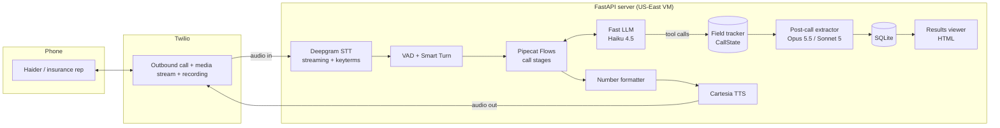
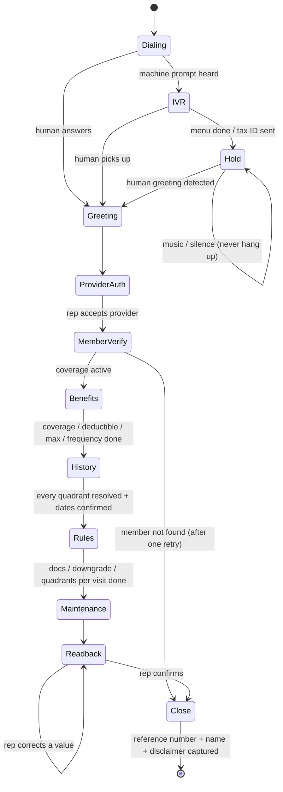

# Implementation Plan — SRP Benefits Verification Voice Agent

**Approach:** a speech-to-text → LLM → text-to-speech pipeline built on **Pipecat + Pipecat Flows** over **Twilio**. The call is driven by a checklist of fields held in code, so the LLM handles the conversation while the code decides what's still missing. A stronger LLM builds the final JSON after the call and checks it against the transcript.

See [PROBLEM_STATEMENT.md](PROBLEM_STATEMENT.md) for the *what* and [6_DAY_PLAN.md](6_DAY_PLAN.md) for the *when*.

---

## 1. Architecture



**Why a cascade pipeline and not speech-to-speech:** every stage produces text we can inspect, so IDs and numbers can be checked and fixed at each step, and we end up with a clean transcript to cite as the source for each field.

---

## 2. Stack

| Layer | Pick | Fallback |
|---|---|---|
| Voice framework | Pipecat + Pipecat Flows | LiveKit Agents |
| Phone line | Twilio (US number) | Telnyx |
| Speech-to-text | Deepgram Nova-3, streaming, keyterm prompting | AssemblyAI |
| Turn-taking | Silero VAD + Pipecat Smart Turn | — |
| LLM during the call | `claude-haiku-4-5-20251001` | OpenAI fast/mini tier |
| LLM after the call | `claude-opus-5-5` (or `claude-sonnet-5`) | — |
| Text-to-speech | Cartesia | ElevenLabs |
| Backend | Python 3.11+, FastAPI, uvicorn | — |
| Validation | Pydantic v2 | — |
| Storage | SQLite (via `sqlite3` / SQLModel) | JSON files |
| Viewer | HTML + a little JS, served by FastAPI | Streamlit |
| Tunnel (development only) | ngrok | cloudflared |
| Hosting (real calls) | Small US-East VM (Fly.io / Render / a VPS) | — |

> **Hosting note:** Twilio media, Deepgram and Cartesia are mostly in the US. Running the server on a laptop in Pakistan adds roughly 300–600 ms per turn, so real calls run from a US-East machine. Haider is in the US too, so a US-East server keeps the whole call path in one country.

---

## 3. Repository layout

```
voice-agent/
├── app/
│   ├── main.py              # FastAPI: /call (start), /twiml, /ws (media), /calls (viewer)
│   ├── config.py            # env vars + scenario loading
│   ├── pipeline.py          # builds the Pipecat pipeline for one call
│   ├── callflow/
│   │   ├── nodes.py         # one function per call stage (Flows NodeConfig)
│   │   ├── prompts.py       # system prompts and per-stage task messages
│   │   └── tools.py         # record_field, mark_unknown, press_digits, end_call, ...
│   ├── state.py             # CallState: field tracker + "what's missing"
│   ├── schema.py            # Pydantic output model (mirrors the reference JSON)
│   ├── speech_format.py     # digits/dates/money → speakable text
│   ├── telephony.py         # Twilio outbound call + TwiML
│   ├── ivr_test.py          # fake payer phone menu for testing keypad tones and hold
│   ├── eligibility.py       # date math: next eligible date per quadrant
│   ├── postcall.py          # transcript → final JSON (strong LLM) + reconciliation
│   ├── storage.py           # SQLite read/write
│   └── templates/           # viewer HTML
├── scenarios/
│   └── lana_kane.yaml       # practice + patient + payer phone number
├── sim/
│   ├── text_agent.py        # the same brain, text mode
│   ├── rep.py               # scripted menu/hold + LLM plays a difficult rep
│   ├── run.py               # run + score a persona
│   ├── personas/            # cooperative, hedger, strict, corrector, robot-challenger, ...
│   ├── ground_truth/        # the answer key for each persona
│   └── scorecard.py         # field-by-field accuracy report
├── tests/                   # unit tests: formatter, eligibility math, schema
├── docs/
│   └── DECISION_LOG.md      # one line per test-based decision
├── .env.example
├── pyproject.toml
└── README.md
```

---

## 4. Call flow (Pipecat Flows nodes)

Each node has **its own short prompt, its own tools, and a condition for moving on**. Moving between nodes happens in code, triggered by tool calls, not by the LLM deciding on its own.



| Node | The agent's job | Tools | Moves on when |
|---|---|---|---|
| **IVR** | Answer the menu by voice or keypad | `press_digits`, `say`, `human_detected` | Menu finished or a human is detected |
| **Hold** | Stay silent and watch for a greeting | `human_detected` | A greeting-like sentence is heard ("thanks for holding, this is…") |
| **ProviderAuth** | Disclose it's an assistant; give practice, provider, tax ID, NPI, callback | `record_field`, `repeat_identifier` | The rep asks about the member |
| **MemberVerify** | Give patient name, DOB, member ID, relationship | `record_field`, `member_not_found` | Active status and effective date are captured |
| **Benefits** | Coverage %, class, deductible, max, remaining, frequency | `record_field`, `mark_unknown` | All of these fields are resolved |
| **History** | Paid quadrants, what's **not** on file, confirm next eligible dates | `record_quadrant`, `confirm_eligibility` | All 4 quadrants are resolved |
| **Rules** | Documentation, downgrade rule, quadrants per visit | `record_field`, `mark_unknown` | All resolved |
| **Maintenance** | D4910 coverage, frequency, shared with D1110, waiting period | `record_field`, `mark_unknown` | All resolved |
| **Readback** | Read the summary aloud and apply corrections | `apply_correction`, `readback_confirmed` | The rep confirms |
| **Close** | Reference number, rep's full name, verbatim disclaimer | `record_field`, `end_call` | All three captured, or the rep refuses |

**"Resolved"** means `answered`, `refused`, or `unknown` after one follow-up. The agent never asks the same question a third time.

---

## 5. The field tracker (the core idea)

`CallState` lives in code and is the **single source of truth** during the call.

```python
class FieldStatus(str, Enum):
    PENDING = "pending"; ANSWERED = "answered"; REFUSED = "refused"
    UNKNOWN = "unknown"; CORRECTED = "corrected_on_readback"

class Captured(BaseModel):
    value: Any | None = None
    status: FieldStatus = FieldStatus.PENDING
    quote: str | None = None        # the rep's exact words
    turn: int | None = None         # transcript turn index
```

- **Tools write to it:** `record_field(path="srp.deductible.amount", value=50, quote="Fifty dollars individual")`.
- **Each node's prompt is built from it:** it lists what's already answered (so the agent doesn't ask again when Haider answers ahead) and what's still missing.
- **Answers out of order are welcome:** if Haider volunteers the D4910 frequency during Benefits, it's recorded and simply never asked later.
- **Nothing is guessed:** any field still `pending` at the end of the call becomes `null` with `status: "unknown"`.

---

## 6. Key behaviours and how we build them

| Behaviour | How |
|---|---|
| **Hold music / silence** | In the Hold node the LLM speaks only through a `human_detected` tool. Normal talking is turned off, and silence timeouts are disabled. Hold is capped at 25 min. |
| **"Let me pull that up"** | The prompt says: give one short acknowledgement ("Sure, take your time") and then stay silent. We raise the end-of-turn wait in these nodes. After about 20 s of silence, check in gently once ("Still there?"). |
| **Rep talks over the agent** | Interruptions are on: the agent stops speaking when the rep starts, and handles what the rep said. |
| **Hedging ("it depends")** | Record the quote with `status=unknown`, ask one clarifying follow-up, then move on. |
| **Two answers at once** | Tools accept several fields in one call, and the tracker drops anything already answered. |
| **"Are you a robot?"** | Say honestly that it's an automated assistant for Cedar Park Dental, then carry on. |
| **Member not found** | Re-read the member ID digit by digit and spell the name once, then close politely with the fields marked `unknown`. |
| **Read-back correction** | `apply_correction` stores both values and flags `remaining_corrected_on_readback: true`. |
| **Date math** | `eligibility.py` computes paid date + frequency in plain code. The agent says the result aloud and asks the rep to confirm. |
| **Keypad tones** | A `press_digits` tool pushes an `OutputDTMFFrame`. Pipecat's Twilio transport has no native DTMF, so it plays the tones as audio into the stream. If a menu doesn't recognise them, the fallback is updating the call with Twilio `<Play digits>`. |

### Number formatting (`speech_format.py`)

We never let the TTS engine guess how to read an ID.

| Input | Spoken as |
|---|---|
| Tax ID `84-1552037` | "eight four… one five five… two zero three seven" |
| NPI `1477588213` | "one four seven seven… five eight eight… two one three" |
| Member ID `MDB40719883` | "M as in Mary, D as in David, B as in Bravo… four zero seven… one nine… eight eight three" |
| DOB `1983-07-09` | "July ninth, nineteen eighty-three" |
| Phone `303-555-0192` | "three zero three… five five five… zero one nine two" |
| `$1,247` | "one thousand two hundred forty-seven dollars" |

### Speech-to-text keyterms (Deepgram)
`SRP, scaling, root planing, D4341, D4342, D4910, D1110, prophy, periodontal, quadrant, upper right, lower left, deductible, pre-authorization, narrative, radiographs, pocket depth, bone loss, Meridian, Cedar Park`, plus the scenario's names and IDs.

---

## 7. After the call

1. Save the full transcript (with turn numbers and timestamps), the Twilio recording URL, Pipecat latency metrics, and the live `CallState`.
2. **Extraction:** the strong LLM reads the transcript and fills the Pydantic schema. Each field must quote its source turn.
3. **Reconciliation:** compare the live tracker with the post-call extraction.
   - If they agree, keep the value.
   - If they disagree, take the value backed by the more recent quote (a read-back correction wins) and mark the field `needs_review`.
4. Recompute every date deterministically in code.
5. Validate with Pydantic, store in SQLite, and show it in the viewer.

The output schema mirrors the reference JSON (member, srp, d4910, call) and adds `status` / `quote` / `turn` to every field.

---

## 8. Results viewer

A FastAPI page at `/calls/{id}` showing:
- A summary card (patient, payer, rep, reference number, call length, hold time)
- The structured JSON, with a colour for each field's status and a hover showing the rep's quote
- The quadrant grid (UR/UL/LR/LL → paid date / next eligible)
- The full transcript with each captured field highlighted
- An audio player for the Twilio recording
- Latency stats (median and p95 response time)

---

## 9. Test harness

**Text mode** (fast, cheap, repeatable): `sim/run.py` runs the agent's flow against an LLM playing the rep, with no audio. Each persona has a ground-truth answer key.

| Persona | Tests |
|---|---|
| Cooperative (Denise) | Happy path, matches the reference call |
| Strict authenticator | Demands NPI, spelling, repeats |
| Hedger | "Should be", "depends on the plan", partial answers |
| Corrector | Wrong value early, corrected on read-back |
| Rapid-fire | Several answers at once, out of order |
| Robot-challenger | "Are you a bot?", "I can only talk to staff" |
| Stonewaller | Refuses some fields, "call back later", member not found |
| Long pauses | "Let me pull that up" + 30–60 s silences, hold mid-call |

`sim/scorecard.py` prints a table per persona: field coverage, field accuracy, turns, and whether the call finished.

**Live mode:** real Twilio calls to our own phone, using the Twilio Dev Phone or a second Twilio number, with a teammate reading a rep script. These test timing, speech-to-text and text-to-speech.

---

## 10. Decisions to settle by testing

| Decision | Test | Pick by |
|---|---|---|
| LLM during the call | 5 simulator personas × 2 fast models | Fields captured correctly + response time |
| Text-to-speech voice | Read tax ID, member ID, a date over a real phone call | Clarity of numbers on phone audio |
| End-of-turn wait | 0.5 / 0.8 / 1.2 s on the long-pauses persona | Fewest interruptions of the rep without slow replies |

Each result goes into `docs/DECISION_LOG.md` as one line: date, decision, evidence.

---

## 11. Accounts and setup (we have none yet)

| Service | What to do | Notes |
|---|---|---|
| **Twilio** | Sign up, **upgrade to paid** (~$20), buy a US local number, confirm **United States** is enabled in Voice Geographic Permissions | Trial accounts play a message and require the callee to press a key, which isn't acceptable for the demo |
| **Deepgram** | Sign up and create an API key | Free credit covers development |
| **Cartesia** | Sign up, create an API key, pick 2–3 voices | Free tier to start |
| **Anthropic** | Create an API key and add credits | Haiku 4.5 live, Opus 5.5 / Sonnet 5 after the call |
| **OpenAI** (optional) | API key for the LLM comparison | Only if we test the fallback |
| **ngrok** | Sign up, create an auth token | Local development only |
| **Fly.io / Render / VPS** | Account for the US-East deployment | Day 3 |
| **GitHub** | A repo for the code | Share with Amplify at the demo |

Estimated cost for the whole build: **under $50** (approximate). US calls are about $0.014/min.

---

## 12. Risks

| Risk | Impact | Mitigation |
|---|---|---|
| Keypad tones don't pass through the Twilio media stream | Can't navigate the phone menu | Generate the tones as audio; or use Twilio's `<Play digits>` via a call update |
| Twilio signup or payment from Pakistan is slow | Blocks Day 1 | Start signup first thing; Telnyx as a backup |
| Speech-to-text mishears IDs or amounts | Wrong data | Keyterms, a read-back stage, and post-call reconciliation |
| Response time over 1.5 s | Sounds robotic | US-East hosting, Haiku, Cartesia, streaming at every stage |
| Hold music triggers speech | Agent talks over music | Hold node with LLM output off; greeting detection only |
| LLM makes up a value | Wrong JSON | Tool-only capture with quotes; `null` for anything not answered |
| Live demo fails | Bad impression | A recorded backup call plus simulator scorecards |

---

## 13. Definition of done

- [ ] One command places an outbound call to a given number using a scenario file
- [ ] The agent handles a phone menu with keypad tones, hold, authentication, all benefit stages, read-back and close
- [ ] The simulator scorecard shows ≥ 95% field accuracy across all personas
- [ ] At least 3 successful live calls, one of them to a real US phone
- [ ] The viewer shows the JSON, sources, transcript, recording and latency
- [ ] The README covers setup, architecture, design decisions and results
- [ ] A backup recording of a full successful call
